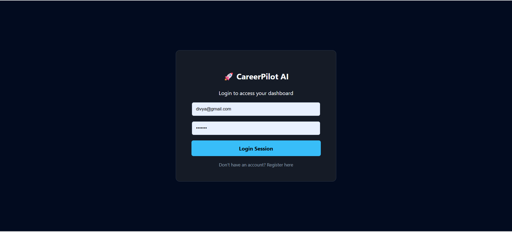
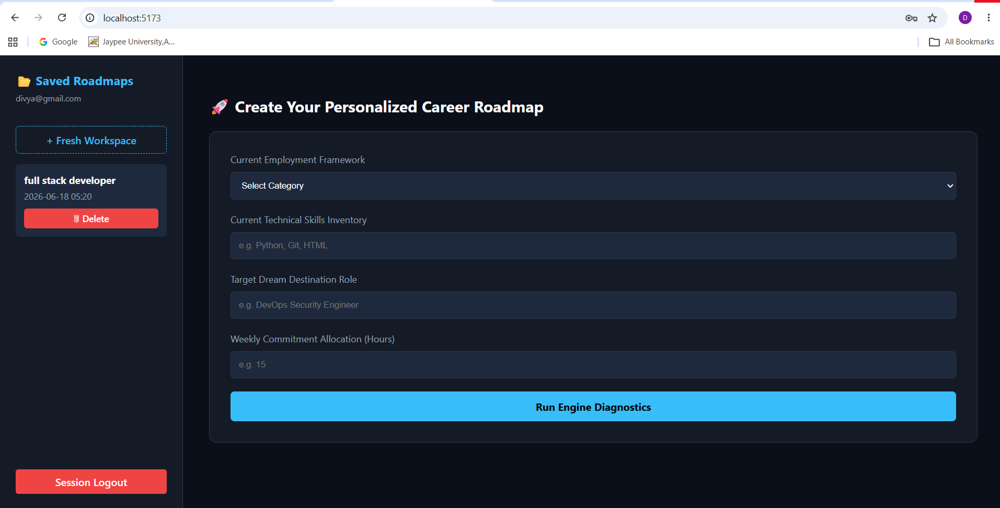
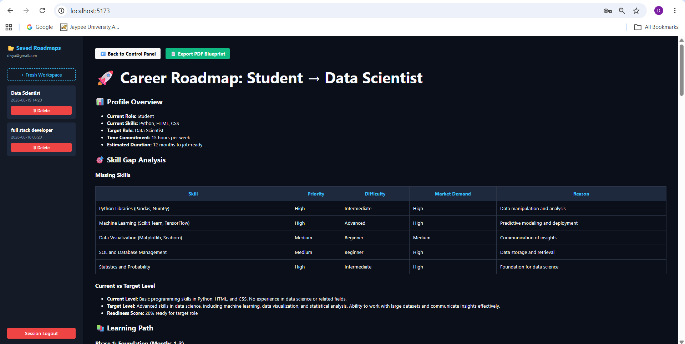

# 🚀 AI Career Roadmap Generator

An AI-powered web application that generates personalized career roadmaps based on a user's current skills, target role, and learning commitment. The platform uses Large Language Models (LLMs) to provide structured learning paths, project recommendations, certifications, interview preparation guidance, and career growth strategies.

---

##  Features

- 🔐 User Authentication (Register/Login)
- 🤖 AI-Powered Career Roadmap Generation
- 📚 Personalized Learning Paths
- 🛠️ Project Recommendations
- 🏆 Certification Suggestions
- 💼 Interview Preparation Guidance
- 📊 Skill Gap Analysis
- 📝 Roadmap History Management
- 🗑️ Delete Saved Roadmaps
- 📄 Export Roadmap as PDF
- 🎨 Responsive User Interface

---

##  Tech Stack

### Frontend
- React.js
- Vite
- CSS3
- React Markdown
- Remark GFM

### Backend
- FastAPI
- Python
- JWT Authentication
- Bcrypt

### Database
- MongoDB

### AI Integration
- Groq API
- Llama 3.3 70B Versatile Model

---

##  Project Structure

```text
AI-Career-Roadmap-Generator
│
├── frontend/
│   ├── src/
│   ├── public/
│   └── package.json
│
├── backend/
│   ├── main.py
│   ├── prompt.py
│   ├── requirements.txt
│   └── .env
│
└── README.md
```

---

## ⚙️ Installation & Setup

### 1️ Clone Repository

```bash
git clone https://github.com/divy686/ai-career-roadmap-generator.git
cd ai-career-roadmap-generator
```

### 2️ Backend Setup

```bash
cd backend
python -m venv .venv
```

Activate Environment

Windows:

```bash
.venv\Scripts\activate
```

Install Dependencies

```bash
pip install -r requirements.txt
```

Create `.env` file

```env
MONGO_URI=your_mongodb_connection_string
GROQ_API_KEY=your_groq_api_key
JWT_SECRET=your_secret_key
```

Run Backend

```bash
uvicorn main:app --reload
```

Backend will run on:

```text
http://127.0.0.1:8000
```

---

### 3️ Frontend Setup

```bash
cd frontend
npm install
npm run dev
```

Frontend will run on:

```text
http://localhost:5173
```

---

##  Usage

1. Register a new account.
2. Login securely.
3. Enter:
   - Current Role
   - Current Skills
   - Target Role
   - Weekly Learning Hours
4. Generate a personalized roadmap.
5. View and manage saved roadmaps.
6. Export roadmap as PDF.

---

##  Screenshots

### Login Page


### Dashboard


### Generated Roadmap

---

##  Example Input

```text
Current Role: Student
Current Skills: Python, HTML, CSS
Target Role: Data Scientist
Time Commitment: 15 Hours/Week
```

---

##  Example Output

- Skill Gap Analysis
- Learning Roadmap
- Recommended Projects
- Certifications
- Interview Preparation Plan
- Salary Insights

---

##  Security Features

- Password Hashing using Bcrypt
- JWT-Based Authentication
- Protected User Data
- Secure API Communication

---

##  Future Enhancements

- Dark/Light Theme Toggle
- Roadmap Download as DOCX
- AI Chat Career Mentor
- Learning Progress Tracker
- Job Recommendation Engine
- Resume Analyzer

---

##  Author

**Divya Rana**

Student at Jaypee University, Anoopshahr

Passionate about Web Development, Artificial Intelligence, Machine Learning, and Data Science.

Focused on building real-world full-stack and AI-powered applications.
---

##  License

This project is developed for educational and portfolio purposes.
